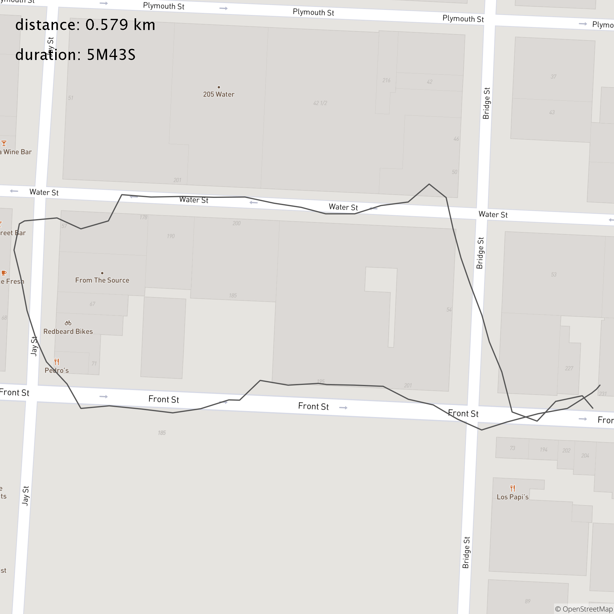

# CSV to Maps



## Goal

Users take their dog for a walk every day. These walks are tracked using GPS.


The included [data set](https://raw.githubusercontent.com/mavenraven/csvToMaps/master/src/test/resources/gps_dataset.csv) contains
raw GPS coordinates from a few different walks around NYC.

For this project, you will write a simple program that:
1. Parses this data set
2. Separates the individual walks
3. Displays each walk on a map along with any interesting statistics

What to display in part 3 and how to display it is entirely up to you. It could calculate the total
duration or distance traveled for each walk. It could even call a service to find out what the
weather was like during that day. Whatever seems interesting!

## Notes

csvToMaps is a Java project that I implemented for a take home interview.

I happened to write this project in a more functional programming style. For production code, I follow the established conventions of the codebase.

For example, some Ruby on Rails projects follow "Hexagonal Architecture", some projects follow the service object pattern, and some simply use fat models. I'm completely flexible as your happiness is my ultimate goal!

## Usage
```
Usage: CSVToMaps [options]
  Options:
  * --csvFileLocation
      Location of input GPS CSV data.
  * --mapboxAccessToken
      See https://docs.mapbox.com/help/how-mapbox-works/access-tokens/.
```
## Building
`./mvnw package`

## Running
`java -jar target/csvToMaps-1.0-SNAPSHOT.jar`
## Running Integration Tests
` ./mvnw verify -DmapboxAccessToken=<access token> -DdeepAIApiKey=<api key>`

The mapbox access token is passed through to the system under test and is used for map generation. One can be acquired at [https://docs.mapbox.com/help/how-mapbox-works/access-tokens/](https://docs.mapbox.com/help/how-mapbox-works/access-tokens/).

The deep AI API key is used to compare the output of the integration test with a previously generated map. The endpoint uses machine learning to compare how similar the two images are. A key can be acquired at [https://deepai.org/](https://deepai.org/).

